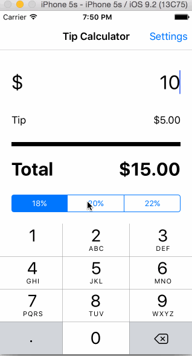

# TipCalculator

This is a Tip Calculator application for iOS submitted as the [pre-assignment](https://gist.github.com/timothy1ee/7747214) requirement for CodePath.

## Description

User can input a bill amount, and the tip amount and total will be
computed based on the input. User can also choose a default tip
percentage by navigating to the settings and adjusting the tip slider.
When the user taps on the view back on the tip calculator view, the view
will slide up the total amount, and display the split amount amongst 2,
3, and 4 people and dismiss the keyboard. Tapping the view again will
reverse the transition and bring back the keyboard to enter the bill
amount.

## Installation Instruction

Load the project directory into xcode by open > file directory to the
.xcodeproj file (top level). Build and run the project.

Time spent: 4

Completed:

* [x] Required: User can enter a bill amount, choose a tip percentage, and see the tip and total values.
* [x] Required: Settings page to change the default tip percentage.
* [x] Optional: UI animations
* [x] Optional: Remembering the bill amount across app restarts (if <10mins)
* [x] Optional: Using locale-specific currency and currency thousands separators.
* [x] Optional: Making sure the keyboard is always visible and the bill amount is always the first responder. This way the user doesn't have to tap anywhere to use this app. Just launch the app and start typing.

Gif created with <a href="http://www.cockos.com/licecap/">LiceCap</a>.

### License

MIT
